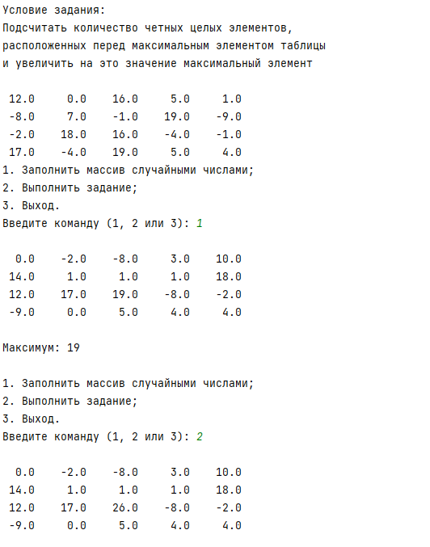

# ArSePython3
Третье задание для курса "Разработка кроссплатформенных приложений"

_Этот репозиторий предназначен для хранения файлов программ на языке Python для университетского курса "Разработка кроссплатформенных приложений"._

Разработано в "Торайгыров университете": https://tou.edu.kz/ru/
